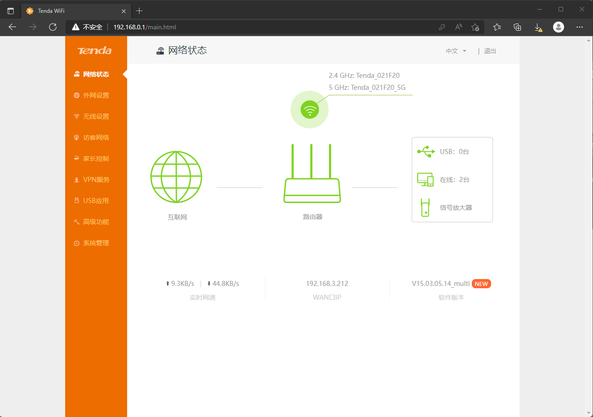
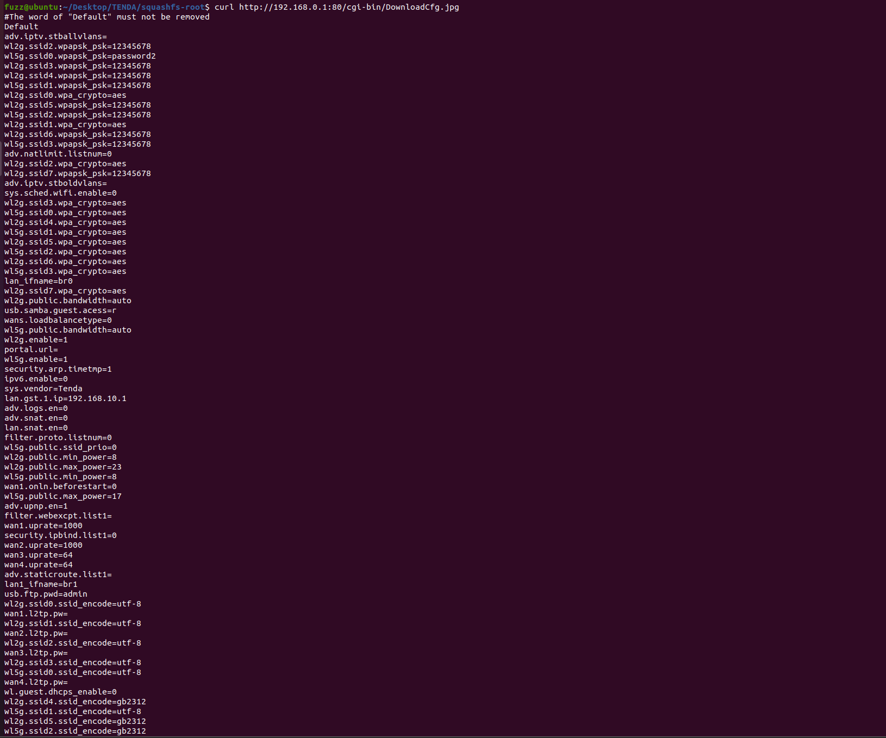

**Affected Product**: Tenda AC9 Router

**Affected Firmware Versions**:  V15.03.05.14_multi

**Vulnerability Type**: Sensitive Information Leakage

------
### **Vulnerability Description**

A data disclosure vulnerability exists in the Tenda ac9 v1.0 router with firmware version V15.03.05.14_multi. The /cgi-bin/DownloadCfg.jpg configuration file can be read without authorization, leading to the leakage of sensitive information such as Wireless network password and MD5 hash of administrator user account password.

---
### **PoC**

`curl http://192.168.0.1:80/cgi-bin/DownloadCfg.jpg`

